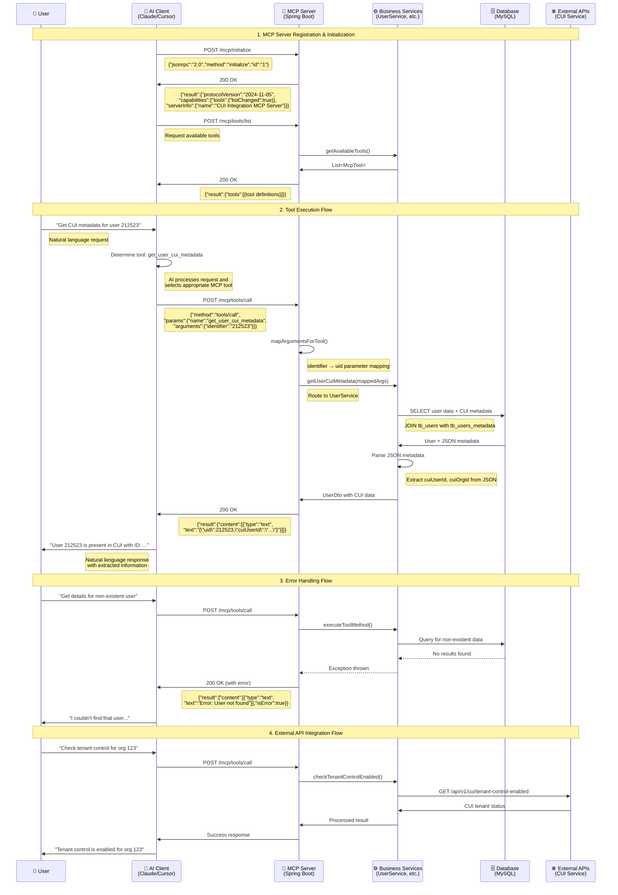

# MCP Server Request/Response Flow Documentation

This document explains the complete request/response flow for the CUI Integration MCP Server, including registration, tool execution, and error handling patterns.

## Table of Contents
- [Overview](#overview)
- [MCP Server Registration Flow](#mcp-server-registration-flow)
- [Tool Execution Flow](#tool-execution-flow)
- [Sequence Diagram](#sequence-diagram)
- [Key Components](#key-components)
- [Error Handling](#error-handling)
- [Parameter Mapping](#parameter-mapping)

## Overview

The CUI Integration MCP Server follows the Model Context Protocol (MCP) specification to provide standardized access to CUI Integration Service functionality. The server acts as a bridge between AI clients (like Claude Desktop, Cursor) and the underlying business services.

## MCP Server Registration Flow

When the MCP server is registered with an AI client, the following process occurs:

### 1. Client Configuration
The AI client reads configuration from files like `claude-desktop-config.json` or `cline-config.json`:

```json
{
  "mcpServers": {
    "cui-integration": {
      "command": "docker",
      "args": ["run", "--rm", "-i", "--network", "host", "cui-mcp-server:latest"],
      "env": {
        "SPRING_PROFILES_ACTIVE": "docker"
      }
    }
  }
}
```

### 2. Server Startup
- Spring Boot application starts (`McpServerApplication.java`)
- REST endpoints are exposed at `/mcp/*`
- Database connections and external service clients are initialized
- Health checks become available at `/mcp/health`

### 3. Client Connection
- AI client establishes HTTP connection to the MCP server
- Connection can be direct HTTP or through proxy/bridge scripts

### 4. Initialization Handshake
- Client sends `POST /mcp/initialize` request
- Server responds with protocol version and capabilities
- Tool discovery happens via `POST /mcp/tools/list`

## Tool Execution Flow

When a user requests a tool execution through the AI client:

### 1. User Request
User provides natural language input:
```
"Get CUI metadata for user 212523"
```

### 2. AI Processing
- AI client analyzes the request
- Determines appropriate MCP tool: `get_user_cui_metadata`
- Extracts parameters: `{"identifier": "212523"}`

### 3. Tool Execution Request
AI client sends HTTP request:
```json
POST /mcp/tools/call
{
  "jsonrpc": "2.0",
  "id": "request-123",
  "method": "tools/call",
  "params": {
    "name": "get_user_cui_metadata",
    "arguments": {
      "identifier": "212523"
    }
  }
}
```

### 4. Server Processing
1. **McpController** receives the request
2. **McpToolService** orchestrates the execution
3. **Parameter mapping** converts `identifier` to service-specific parameters
4. **Business service** (e.g., UserService) executes the logic
5. **Data access** queries database or external APIs
6. **Response formatting** converts results to MCP format

### 5. Response Delivery
Server returns structured response:
```json
{
  "jsonrpc": "2.0",
  "id": "request-123",
  "result": {
    "content": [{
      "type": "text",
      "text": "{\"uid\":212523,\"name\":\"ss-user1\",\"cuiUserId\":\"c3985979-fe7f-4f4d-824f-6dbcf6126196\"}"
    }],
    "isError": false
  }
}
```

## Sequence Diagram



## Key Components

### 1. McpController (`/mcp/*` endpoints)

**Responsibilities:**
- Handle MCP protocol requests
- Validate request format
- Route requests to appropriate services
- Format responses according to MCP specification

**Key Endpoints:**
- **`POST /mcp/initialize`**: Establishes MCP protocol handshake
- **`POST /mcp/tools/list`**: Returns available tools and their schemas
- **`POST /mcp/tools/call`**: Executes specific tools with parameters
- **`POST /mcp/ping`**: Connection health check
- **`GET /mcp/health`**: Server health status

### 2. McpToolService (Tool Orchestration)

**Responsibilities:**
- Manage available tools catalog
- Route tool execution requests
- Handle parameter mapping
- Format execution results

**Key Methods:**
- **`getAvailableTools()`**: Returns all 25+ available tools with schemas
- **`executeTool()`**: Routes tool calls to appropriate services
- **`mapArgumentsForTool()`**: Maps generic `identifier` to specific parameters

### 3. Business Services

#### UserService
- User management operations
- CUI metadata retrieval and parsing
- User-organization relationship queries

#### OrganizationService  
- Organization details and configuration
- Tenant mapping status
- Phase 2 feature flag management

#### SyncService
- Synchronization monitoring
- Retry queue management
- Performance metrics

#### MonitoringService
- System health diagnostics
- External service connectivity
- Kafka stream monitoring

### 4. Data Access Layer

**Database Access:**
- Direct SQL queries via `NamedParameterJdbcTemplate`
- Connection pooling and transaction management
- Support for multiple database schemas (`te_admin`)

**External API Integration:**
- HTTP clients for CUI Integration Service
- Retry logic and circuit breaker patterns
- Timeout and error handling

## Error Handling

### 1. Graceful Degradation
- Services handle missing data gracefully
- External service unavailability doesn't crash the server
- Fallback responses when possible

### 2. Structured Error Responses
```json
{
  "jsonrpc": "2.0",
  "id": "request-123",
  "result": {
    "content": [{
      "type": "text", 
      "text": "Error: Required argument 'org_id' is missing"
    }],
    "isError": true
  }
}
```

### 3. Comprehensive Logging
- Request/response logging at controller level
- Business logic logging in services
- Database query logging for debugging
- External API call logging

### 4. Exception Handling Hierarchy
1. **Controller Level**: Catches all exceptions, formats MCP responses
2. **Service Level**: Handles business logic exceptions
3. **Data Access Level**: Handles database and API connectivity issues

## Parameter Mapping

The server implements intelligent parameter mapping to bridge the gap between generic MCP tool parameters and service-specific requirements:

### Generic to Specific Mapping
```java
// Generic MCP parameter
{"identifier": "212523"}

// Maps to service-specific parameters based on tool:
switch (toolName) {
    case "get_user_cui_metadata" -> {"uid": "212523"}
    case "get_user_organizations" -> {"user_email": "212523"}  
    case "get_organization_details" -> {"org_id": "212523"}
}
```

### Tool-Specific Schema Generation
Each tool has a specific input schema that defines expected parameters:

```java
// User tools expect identifier as user ID or email
createUserByIdSchema() -> {"identifier": "User ID or email"}

// Organization tools expect identifier as organization ID  
createOrgDetailsSchema() -> {"identifier": "Organization ID"}
```

### Validation and Type Conversion
- String to Long conversion for numeric IDs
- Email format validation for user lookups
- Parameter presence validation before service calls

## Performance Considerations

### 1. Connection Pooling
- Database connection pooling via HikariCP
- HTTP client connection pooling for external APIs

### 2. Caching Strategy
- Tool schema caching to avoid repeated generation
- Database query result caching where appropriate

### 3. Async Processing
- Non-blocking I/O for external API calls
- Async logging to avoid blocking request threads

### 4. Resource Management
- Proper resource cleanup in finally blocks
- Connection timeout configuration
- Memory-efficient JSON parsing

## Security Considerations

### 1. Input Validation
- Parameter sanitization to prevent SQL injection
- Input length limits to prevent DoS attacks
- Type validation for all parameters

### 2. Authentication & Authorization
- API key validation for MCP client connections
- Role-based access control for sensitive operations
- Audit logging for all tool executions

### 3. Data Protection
- Sensitive data masking in logs
- Secure database connection configuration
- HTTPS enforcement for external API calls

## Monitoring and Observability

### 1. Health Checks
- Database connectivity checks
- External service availability checks
- Memory and CPU usage monitoring

### 2. Metrics Collection
- Request/response time metrics
- Tool execution success/failure rates
- Database query performance metrics

### 3. Alerting
- Failed tool execution alerts
- Database connection failure alerts
- External service unavailability alerts

---

For more information about specific tools and their usage, see the main [README.md](../README.md).
